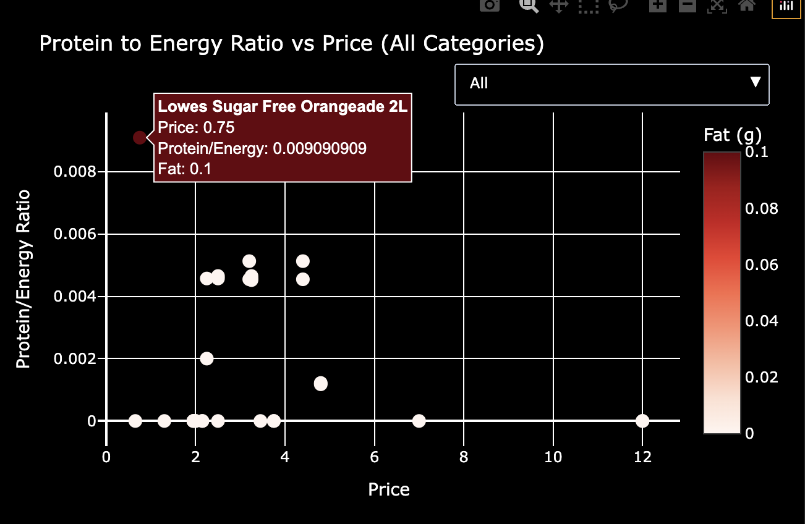

# web-scraping-project

## description

a project to scrape product data from various grocery store websites in the uk for price and nutrition comparison. thought a visualization with the best health benefits in each product category could come useful. imagine a graph for each search query which shows which products have the best protein/carb/fat ratios

## scraping_journey

all scraping attempts are coded and tested in this repo.

successfully scraped product data using selenium and sainsbury's hidden api.

ran into trouble with dynamic dropdowns inside sainsbury's product page, so tried scrapy, but antibot protection blocked me. 

got comfortable with using the scrapy shell and making xpath/css selectors

tried scraping tesco (not messing with them again). asda's scraped html says "REQUEST INTERCEPTED" which was fun to see

currently, the only option is to try iceland, but i haven't figured out how to handle dynamic javascript dropdowns in html. 

tried morrisons — nutritional data is available without dynamic content. ran into some 403 errors with scrapy, but tweaking the settings to be more realistic.

morrisons is great: every result has a category, so it's easy to split and compare products. would be cool to let users filter by category—might add that.

## final product

used selenium to scrape morrisons: had to scroll to load all products, which is fiddly and can break if the website changes. selenium extracts all product links from the search results. then, a scrapy spider visits each product page and gets all nutrition data, storing it in an sqlite database.

the sqlite database is then used to generate an interactive visualization in the visualization jupyter notebook. users can filter by category and explore nutrient ratios across products.

## tl;dr

scrape product data with selenium (just change query) + scrapy (for nutrition data) → save to sqlite → visualize interactively in the visualization jupyter notebook (filter by category, compare nutrients, see prices).

*example: static plot of protein to energy ratio vs price for orange query results. interactive version available in the jupyter notebook.*

